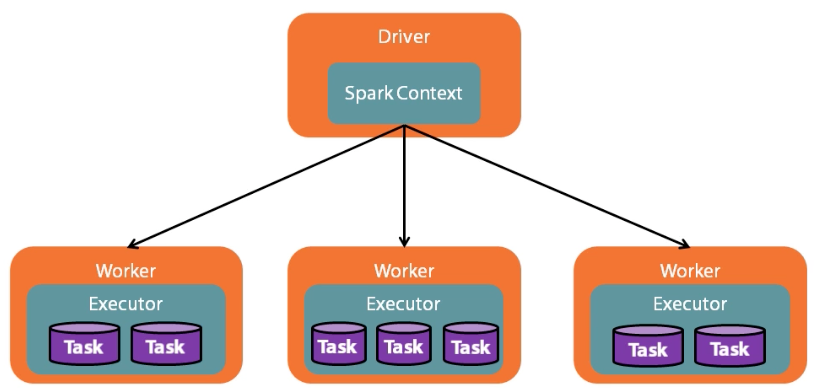

<!-- START doctoc generated TOC please keep comment here to allow auto update -->
<!-- DON'T EDIT THIS SECTION, INSTEAD RE-RUN doctoc TO UPDATE -->
**Table of Contents**  *generated with [DocToc](https://github.com/thlorenz/doctoc)*

- [Apache Spark Fundamentals](#apache-spark-fundamentals)
  - [Hello World: Counting Words](#hello-world-counting-words)
  - [Spark Core: Part 1](#spark-core-part-1)
    - [Spark Application](#spark-application)
    - [What is an RDD?](#what-is-an-rdd)
    - [Loading Data](#loading-data)
      - [Loading from Memory](#loading-from-memory)
      - [Loading from External Source](#loading-from-external-source)

<!-- END doctoc generated TOC please keep comment here to allow auto update -->

# Apache Spark Fundamentals

> My course notes from [Spark course](https://app.pluralsight.com/library/courses/apache-spark-fundamentals/table-of-contents) on Pluralsight.

## Hello World: Counting Words

Run spark-shell with [Docker](https://hub.docker.com/r/gettyimages/spark/)

```shell
docker run --rm -it -p 4040:4040 -v /Users/dbaron/projects/spark-pluralsight/target/scala-2.11:/data gettyimages/spark bash
OR
docker run --rm -it -p 4040:4040 -v /Users/dbaron/projects/spark-pluralsight:/data gettyimages/spark bash
spark-shell
```

Shell automatically creates two values:

`sqlContext` -  Used with Spark sql library (discussed later in this course).

`sc` - Spark context, main starting point of a Spark application.
All Spark jobs begin by creating a Spark context, which acts as delegator for many aspects of control of the distributed application.

Tell the context _our intent_, to load a text file, and store the results in a value `textFile`:

```scala
val textFile = sc.textFile("/usr/spark-2.0.0-preview/README.md")
```

Result is immediately returned in form of `RDD`, which is the most basic abstraction of Spark, sample output:

```scala
textFile: org.apache.spark.rdd.RDD[String] = /usr/spark-2.0.0-preview/README.md MapPartitionsRDD[1] at textFile at <console>:24
```

__RDD__ - Resilient distributed dataset. It's just an _abstraction_ of the operations declared.

Spark's core operations are split into two categories:

__Transformations__ - Lazily evaluated, only storing the intent.

__Actions__ - Results are only computed when an action is executed. For example, `first` action retrieves the first line of the text file:

```scala
textFile.first
```

This returns an actual result:

```scala
res0: String = #  Apache Spark
```

Benefits to Spark laziness, in this example, don't have to read entire text file, only the first line.

Map each line of text file, splitting it into an array of space delimited words, and flattening the resulting sequence of string arrays into a single long sequnece:

```scala
val tokenizedFileData = textFile.flatMap(line=>line.split(" "))
```

This returns another RDD, strings it represents are the words in the file.

Setup sequence for counting by changing each word into a key value pair, where word is key and value is count, seeding with a count of 1 for each uncounted word string.

```scala
val countPrep = tokenizedFileData.map(word=>(word, 1))
```

Now that data is prepared into key-value format, reduce the values down to a single count for each key, adding up all the 1's in each word bucket:

```scala
val counts = countPrep.reduceByKey((accumValue, newValue)=>accumValue + newValue)
```

Sorting list of word count pairs on the count in descending value. `_2` is Scala's way of accessing the object in the second position of a tuple, which is how key-value pair is represented.

## Spark Core: Part 1

Course will be using SBT for building Scala apps.

### Spark Application

All spark applications are managed by a single point, called the _Driver_.

__Driver__ is coordinator of work distributing to as many workers as configured. Driver management is handled through the starting point of any spark application, which is the _SparkContext_.

__SparkContext__ All spark apps are built around this central manager, which orchestrates all the separate pieces of the distributed app. Responsible for:

* Task creator - builds execution graph that will be sent to each worker.
* Scheduler - schedules work across nodes.
* Data locality - takes advantage of existing data location knowledge, sending the work to the data, to avoid unnecessary data movement across network.
* Fault tolerance - monitors tasks for failures so that it can trigger a rebuild of that portion of the dataset on another worker.

It's possible to create multiple spark context's within the same process but not recommended.

[Standalone app](src/main/scala/WordCount.scala) must build its own spark context (unlike spark-shell that automatically builds and exposes the `sc` variable).

Spark dependency is managed in [build.sbt](build.sbt). "provided" specifies that the Spark container application will provide the dependency at runtime.

To build an executable jar, run `sbt package`, noting the location of the generated jar: `/Users/dbaron/projects/spark-pluralsight/target/scala-2.11/spark-pluralsight_2.11-1.0.jar`

To submit application to be executed, pass in fully qualified name of class where main method is defined, address of master node, "\*" (remove the slash) specifies to use as many cores as possible, and provide path to jar containing spark application that was just packaged.

This works given the volume mount specified when running the Spark Docker container.

```shell
spark-submit --class "main.WordCounter" --master "local[*]" "/data/spark-pluralsight_2.11-1.0.jar"
OR
spark-submit --class "main.WordCounter" --master "local[*]" "/data/target/scala-2.11/spark-pluralsight_2.11-1.0.jar"
```

Note that any space separated arguments passed in at the end of the above command line will be passed in as arguments to the main method.
This can be used to make the application more dynamic, for example, by passing in the input and output file paths rather than hard-coding them in the program.

### What is an RDD?

Resilient distributed dataset.

Official definition: Collection of elements partitioned across the nodes of the cluster that can be operated on in parallel.

Collection, similar to list or array. Interface that makes it seem like any other collection. 

In the word count program, loading of text file, manipulating and saving data, has been working with RDD. 

Interface makes it easy to think in collections, while behind the scenes, work is distributed across cluster of machines, so that computation can be run in parallel, reducing processing time. 

Even if one point fails, rest of system can continue processing, while failure can be restarted elsewhere. RDD is designed with fault tolerance. This works because most functions in Spark are lazy.

Instead of immediately executing the functions instructions, instructions are _stored_ for later use in _DAG_ - directed acyclic graph.

Graph of instructions grows through series of calls to _Transformations_ such as map, filter, etc.

DAG is a buildup of functional lineage that will be sent to the workers, which will use instructions to compute final output for spark app.

Lineage awareness makes it possible to handle failures. Each RDD in graph knows how it was built, so it can choose the best path for recovery.

At some point, work needs to be done, this is where...

__Actions__ - set of methods that trigger computations, eg collect, count, reduce. These trigger DAG execution and result in final action against in data, such as returning to driver program or saving to persistent storage.

RDD is _immutable_. Once created, can no longer change it. This refers to the _lineage_, not the data driving it.

Each action triggers fresh execution of the graph. If underlying data changes, then so will the final results (although caching can alter this behaviour, discussed later).
 
__Spark Mechanics__



RDD may be operated on like any other collection, but its distributed across cluster, to be executed in parallel across cpus and/or machines.

Driver application runs just like any other application, until an action is triggered, at which point, the driver and its context distributes the tasks to each node, each of which transform their chunks.

When all nodes have completed their tasks, then next stage of DAG is triggered, repeating until entire graph is completed.

If a chunk of data is lost, DAG scheduler finds a new node and restarts the transformation from correct point, returning to synchronization with rest of the nodes.

### Loading Data

Spark can handle numerous input sources such as file system, distributed file system such as HDFS, or Amazon S3. Change the file path from `file:/` to `hdfs:/` or `s3n:/`.

Can also handle databases, distributed like Cassandra. File formats can be Parkquet, Avro, etc. 

#### Loading from Memory

Can also load from memory, for example, in spark-shell:

```scala
scala> sc.parallelize(1 to 100)
res0: org.apache.spark.rdd.RDD[Int] = ParallelCollectionRDD[0] at parallelize at <console>:25
```

SparkContext is the starting point for loading data into an initial RDD.

`sc.parallelize` distributes a range sequence. Collect back to shell driver to view the sequence:

```scala
scala> res0.collect
es1: Array[Int] = Array(1, 2, 3, 4, 5, 6, 7, 8, 9, 10, 11, 12, 13, 14, 15, 16, 17, 18, 19, 20, 21, 22, 23, 24, 25, 26, 27, 28, 29, 30, 31, 32, 33, 34, 35, 36, 37, 38, 39, 40, 41, 42, 43, 44, 45, 46, 47, 48, 49, 50, 51, 52, 53, 54, 55, 56, 57, 58, 59, 60, 61, 62, 63, 64, 65, 66, 67, 68, 69, 70, 71, 72, 73, 74, 75, 76, 77, 78, 79, 80, 81, 82, 83, 84, 85, 86, 87, 88, 89, 90, 91, 92, 93, 94, 95, 96, 97, 98, 99, 100)
```

Note that ordering is retained, RDD will maintain order if possible.

To see any method signature, enter in shell for example `sc.paral` then hit tab once for autocompete, then tab again for signature.

```scala
def parallelize[T](seq: Seq[T],numSlices: Int)(implicit evidence$1: scala.reflect.ClassTag[T]): org.apache.spark.rdd.RDD[T]
```

`sc.parallelize` takes any sequence `seq: Seq[T]`, also takes an optional parameter to override number of partitions `numSlices: Int`. 
Most RDD loading methods have this optional parameter. If not supplied, uses the default parallelism, in a local shell, will be number of cores.

`sc.makeRDD` does the same thing as `sc.parallelize`.

There is another method for loading in a range:

```scala
sc.range(1, 100).collect
res2: Array[Long] = Array(1, 2, 3, 4, 5, 6, 7, 8, 9, 10, 11, 12, 13, 14, 15, 16, 17, 18, 19, 20, 21, 22, 23, 24, 25, 26, 27, 28, 29, 30, 31, 32, 33, 34, 35, 36, 37, 38, 39, 40, 41, 42, 43, 44, 45, 46, 47, 48, 49, 50, 51, 52, 53, 54, 55, 56, 57, 58, 59, 60, 61, 62, 63, 64, 65, 66, 67, 68, 69, 70, 71, 72, 73, 74, 75, 76, 77, 78, 79, 80, 81, 82, 83, 84, 85, 86, 87, 88, 89, 90, 91, 92, 93, 94, 95, 96, 97, 98, 99)
```

`sc.range` method is built specifically for range scenario, has parameter for step size, which defaults to 1: `def range(start: Long,end: Long,step: Long,numSlices: Int): org.apache.spark.rdd.RDD[Long]`

#### Loading from External Source

For example, to read an entire file so it can be parsed as a single object. Use `sc.wholeTextFiles`. Accepts a directory path (also supports wildcards) so it can load more than one file.

```
def wholeTextFiles(path: String,minPartitions: Int): org.apache.spark.rdd.RDD[(String, String)]
```

Often, data comes in a key-value format. To use this, import hadoop io namespace to make use of its writeable classes to load sequence files.
`sc.sequenceFile` takes path to file, a class type for the keys, and one for value. These classes must extend `Writable`.

```scala
scala> import org.apache.hadoop.io._
scala> sc.sequenceFile("file:///Data/SampleSquenceFile", classOf[Text], classOf]IntWritable])
```

Recommend after loading data, immediately mapping to native types, which avoids serialization issues with Hadoop:

```scala
scala> .map(kv=>(kv._1.toString, kv._2.get))
```

To avoid having to map, use the definition of `sc.sequenceFile` that takes native types `def sequenceFile[K, V](path: String,minPartitions: Int)(implicit km: scala.reflect.ClassTag[K],implicit vm: scala.reflect.ClassTag[V],implicit kcf: () => org.apache.spark.WritableConverter[K],implicit vcf: () => org.apache.spark.WritableConverter[V]): org.apache.spark.rdd.RDD[(K, V)]`

Simpler usage:

```scala
sc.sequenceFile[String, Int]("file:///Data/SampleSquenceFile")
```

All the file loading methods are wrappers around the more generic `sc.hadoopFile`, that handles any Hadoop supported file format. It takes key and value type. 
Additional parameter for input format type provides generic flexibility to handle anything:

```scala
def hadoopFile[K, V](path: String,inputFormatClass: Class[_ <: org.apache.hadoop.mapred.InputFormat[K,V]],keyClass: Class[K],valueClass: Class[V],minPartitions: Int): org.apache.spark.rdd.RDD[(K, V)]
```

All of the above is the __OLD__ Hadoop API.

__NEW__ Hadoop API's similar to old, but do not accept a partitioning hint, but do accept an optional Hadoop configuration to override existing provided by Spark.

```scala
sc.newAPIHadoopFile
def newAPIHadoopFile[K, V, F <: org.apache.hadoop.mapreduce.InputFormat[K,V]](path: String,fClass: Class[F],kClass: Class[K],vClass: Class[V],conf: org.apache.hadoop.conf.Configuration): org.apache.spark.rdd.RDD[(K, V)]
def newAPIHadoopFile[K, V, F <: org.apache.hadoop.mapreduce.InputFormat[K,V]](path: String)(implicit km: scala.reflect.ClassTag[K],implicit vm: scala.reflect.ClassTag[V],implicit fm: scala.reflect.ClassTag[F]): org.apache.spark.rdd.RDD[(K, V)]
```

One final even more generic method is `sc.hadoopRDD`. Only difference between hadoopFile and hadoopRDD is that it doesn't take a path, because input format doesn't _have_ to be a file. 
Instead, both old and new API versions accept a `JobConf`, which is configured for the particular input being loaded. 
